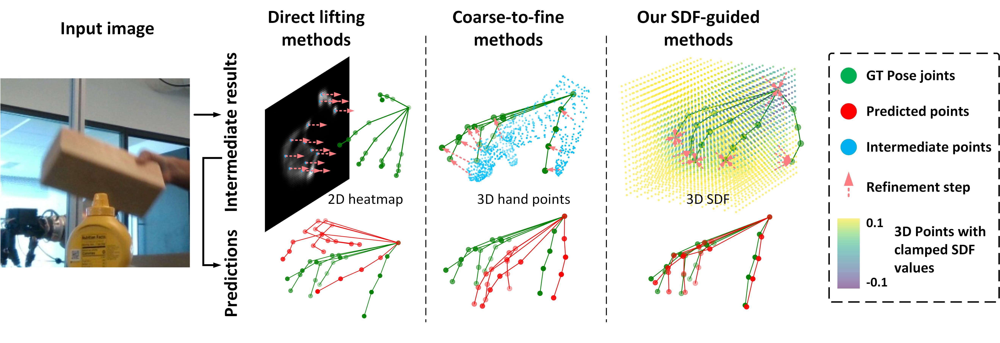

[](https://paperswithcode.com/sota/3d-hand-pose-estimation-on-dexycb?p=hoisdf-constraining-3d-hand-object-pose) [](https://paperswithcode.com/sota/3d-hand-pose-estimation-on-ho-3d?p=hoisdf-constraining-3d-hand-object-pose)

[](https://paperswithcode.com/sota/hand-object-pose-on-dexycb?p=hoisdf-constraining-3d-hand-object-pose) [](https://paperswithcode.com/sota/hand-object-pose-on-ho-3d?p=hoisdf-constraining-3d-hand-object-pose)

# HOISDF: Constraining 3D Hand-Object Pose Estimation with Global Signed Distance Fields
by Haozhe Qi, Chen Zhao, Mathieu Salzmann, Alexander Mathis, EPFL (Switzerland). 

## Overview
* We show that HOISDF achieves state-of-the-art results on hand-object pose estimation benchmarks (DexYCB and HO3Dv2).

* We introduce a hand-object pose estimation network that uses signed distance fields (HOISDF) to introduce implicit 3D shape information.
* This repo contains the official Pytorch implementation of [**HOISDF: Constraining 3D Hand-Object Pose Estimation with Global Signed Distance Fields**](https://openaccess.thecvf.com/content/CVPR2024/html/Qi_HOISDF_Constraining_3D_Hand-Object_Pose_Estimation_with_Global_Signed_Distance_CVPR_2024_paper.html) published at **CVPR'24**. 

News:
* July 2024: We shared preprocessed data of the interacting objects, SDF samples, & trained model weights on [Zenodo](https://zenodo.org/records/11668766)!
* June 2024: We presented the poster at CVPR in Seattle
* June 2024: We presented the poster at FENS in Vienna

## Environment Installation

1. Clone the Current Repo
    ```
   git clone git@github.com:amathislab/HOISDF.git
    ``` 

2. Setup the conda environment 
    ```
    conda create --name hoisdf python=3.9
    conda activate hoisdf
    # install the pytorch version compatible with the your cuda version
    pip install torch==1.12.1+cu116 torchvision==0.13.1+cu116 torchaudio==0.12.1 --extra-index-url https://download.pytorch.org/whl/cu116
    pip install -r requirements.txt
    ```

3. Download MANO model files (`MANO_LEFT.pkl` and `MANO_RIGHT.pkl`) from the [website](https://mano.is.tue.mpg.de/) and place them in the `tool/mano_models` folder.

4. Download the YCB models from [here](https://rse-lab.cs.washington.edu/projects/posecnn/) and set `object_models_dir` in `config.py` to point to the dataset folder. The original mesh models are large and have different vertices for different objects. To enable batched inference, we additionally use simplified object models with 1000 vertices. Download the simplified models from [here](https://zenodo.org/records/11668766) and set `simple_object_models_dir` in `config.py` to point to the dataset folder

5. Download the processed annotation files for both datasets from [here](https://zenodo.org/records/11668766) and set `annotation_dir` in `config.py` to point to the processed data folder.

## Dataset Setup
Depending on the dataset you intend to train/evaluate follow the instructions below for the setup.

### HO3Dv2 Setup
1. Download the dataset from the [website](https://www.tugraz.at/institute/icg/research/team-lepetit/research-projects/hand-object-3d-pose-annotation/) and set `ho3d_data_dir` in `config.py` to point to the dataset folder.
2. Obtain Signed-Distance-Field (SDF) files for every sample. This is only needed for the training set. You can obtain them in either of the following ways. Set `fast_data_dir` in `config.py` to point to the processed SDF folder.
    * Download the processed SDF files for HO3Dv2 training set from [here](https://zenodo.org/records/13228003).
    * Follow the [AlignSDF](https://github.com/zerchen/AlignSDF?tab=readme-ov-file#dataset-preprocessing) repo to generate the original SDF files. Then use the `tool/pre_process_sdf.py` script to process the SDF data.
3. If you want to train HOISDF with the rendered images, download the rendered data including the images from [here](https://zenodo.org/records/13348980) as well as the SDF files from [here](https://zenodo.org/records/13228003) and put them into the `fast_data_dir` folder.


### DexYCB Setup
1. Download the dataset from the [website](https://dex-ycb.github.io/) and set `dexycb_data_dir` in `config.py` to point to the dataset folder.
2. Obtain Signed-Distance-Field (SDF) files for every sample. This is needed for both the training and test sets. You can obtain them in either of the following ways. Set `fast_data_dir` in `config.py` to point to the processed SDF folder.
    * Download the processed SDF files for DexYCB test set from [here](https://zenodo.org/records/11668766) and for the DexYCB full test set from [here](https://zenodo.org/records/13228003). Since the processed SDF files for DexYCB training set and full training set are too big. We unfortunately cannot share them on Zonado and would encourage you to generate them by yourself.
    * Follow the [AlignSDF](https://github.com/zerchen/AlignSDF?tab=readme-ov-file#dataset-preprocessing) repo to generate the original SDF files. Then use the `tool/pre_process_sdf.py` script to process the SDF data.


## Evaluation
Depending on the dataset you intend to evaluate follow the instructions below. To test the model with our trained weights, you can download the weights from the links provided [here](https://zenodo.org/records/11668766) and put them in the `ckpts` folder.

### HO3Dv2
1. In the `config.py`, modify `setting` parameter.
    * `setting = 'ho3d'` for evaluating the model only trained on the HO3Dv2 training set.
    * `setting = 'ho3d_render'` for evaluating the model also trained on the rendered data.
2. Run the following command:
    ```
    python main/test.py --ckpt_path ckpts/ho3d/snapshot_ho3d.pth.tar  # for ho3d setting
    python main/test.py --ckpt_path ckpts/ho3d_render/snapshot_ho3d_render.pth.tar  # for ho3d_render setting
    ```
3. The results are dumped into a `results.txt` file in the folder containing the checkpoint.
4. Also dumped is a `pred_mano.json` file which can be submitted to the [HO-3D (v2) challenge](https://codalab.lisn.upsaclay.fr/competitions/4318) after zipping the file.
5. Hand pose estimation accuracy in the HO-3D challenge leaderboard: [here](https://codalab.lisn.upsaclay.fr/competitions/4318#results), user: *inspire*
 
 
#### DexYCB
1. In the `config.py`, modify `setting` parameter.
    * `setting = 'dexycb'` for evaluating the model only trained on the DexYCB split, which only includes the right hand data.
    * `setting = 'dexycb_full'` for evaluating the model trained on the DexYCB Full split, which includes both the right and left hands data.
2. Run the following command:
    ```
    python main/test.py --ckpt_path ckpts/dexycb/snapshot_dexycb.pth.tar  # for dexycb setting
    python main/test.py --ckpt_path ckpts/dexycb_full/snapshot_dexycb_full.pth.tar  # for dexycb_full setting
    ```
3. The results are dumped into a `results.txt` file in the folder containing the checkpoint.
4. For the `dexycb_full` setting, additional hand mesh results are shown in the `results.txt` file (Table 3 in the paper).


## Training
Depending on the dataset you intend to train follow the instructions below.

1. Set the `output_dir` in `config.py` to point to the directory where the checkpoints will be saved.
2. In the `config.py`, modify `setting` parameter.
    * `setting = 'ho3d'` for training the model on the HO3Dv2 training set.
    * `setting = 'ho3d_render'` for training the model also on the rendered data.
    * `setting = 'dexycb'` for training the model on the DexYCB split, which only includes the right hand data..
    * `setting = 'dexycb_full'` for training the model on the DexYCB Full split, which includes both the right and left hands data.
3. Run the following command, set the `CUDA_VISIBLE_DEVICES` and `--gpu` to the desired GPU ids. Here is an example command for training on two GPUs:
    ```
    CUDA_VISIBLE_DEVICES=0,1 python main/train.py --run_dir_name test --gpu 0,1
    ```
4. To continue training from the last saved checkpoint, add `--continue` argument in the above command.
3. The checkpoints are dumped after every epoch in the 'output' folder of the base directory.
4. Tensorboard logging is also available in the 'output' folder.


## Reference:

If you find our code or ideas useful, please cite:

```
@inproceedings{qi2024hoisdf,
  title={HOISDF: Constraining 3D Hand-Object Pose Estimation with Global Signed Distance Fields},
  author={Qi, Haozhe and Zhao, Chen and Salzmann, Mathieu and Mathis, Alexander},
  booktitle={Proceedings of the IEEE/CVF Conference on Computer Vision and Pattern Recognition},
  pages={10392--10402},
  year={2024}
}
```

Link to CVPR article: [**HOISDF: Constraining 3D Hand-Object Pose Estimation with Global Signed Distance Fields**](https://openaccess.thecvf.com/content/CVPR2024/html/Qi_HOISDF_Constraining_3D_Hand-Object_Pose_Estimation_with_Global_Signed_Distance_CVPR_2024_paper.html)

## Acknowlegements

* Some of the code has been reused from [Keypoint Transformer](https://github.com/shreyashampali/kypt_transformer), [HFL-Net](https://github.com/lzfff12/HFL-Net), [DenseMutualAttention](https://github.com/rongakowang/DenseMutualAttention), and [AlignSDF](https://github.com/zerchen/AlignSDF) repositories. We thank the authors for sharing their excellent work!
* Our work was funded by EPFL and Microsoft Swiss Joint Research Center (H.Q., A.M.) and a Boehringer Ingelheim Fonds PhD stipend (H.Q.). We are grateful to Niels Poulsen for comments on an earlier version of this manuscript. We also sincerely thank Rong Wang, Wei Mao and Hongdong Li for sharing the hand-object rendering [pipeline](https://openaccess.thecvf.com/content/WACV2023/papers/Wang_Interacting_Hand-Object_Pose_Estimation_via_Dense_Mutual_Attention_WACV_2023_paper.pdf).
